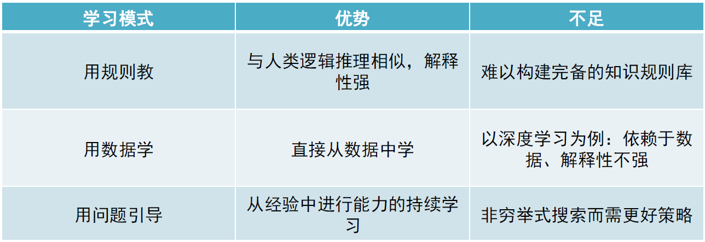
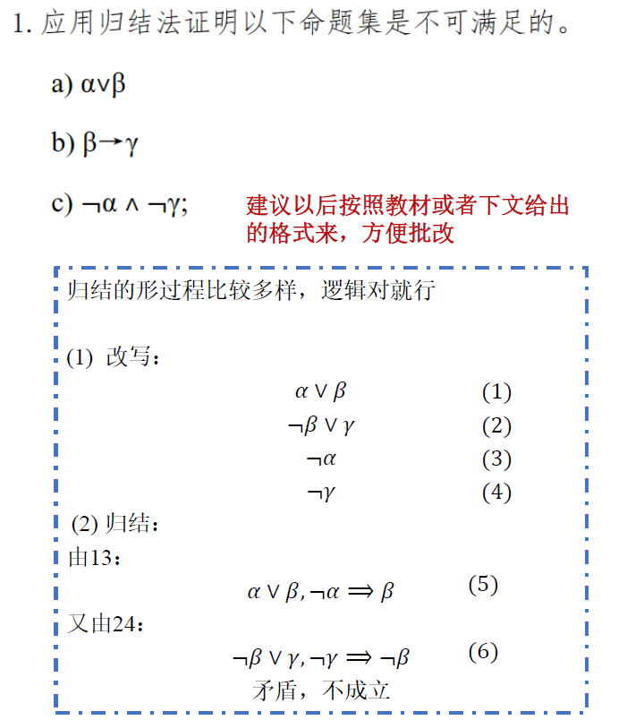
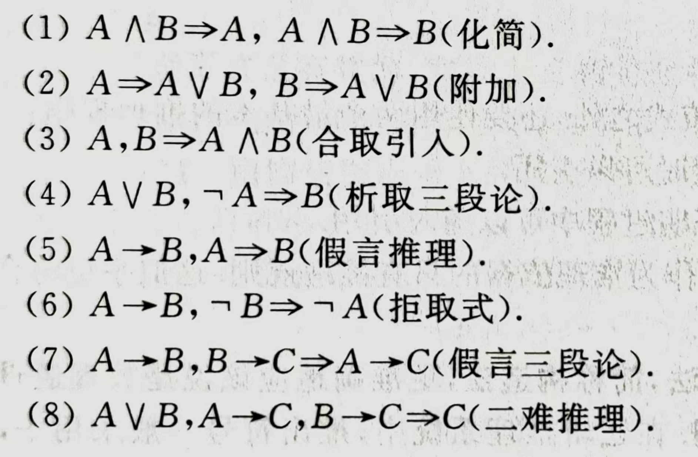
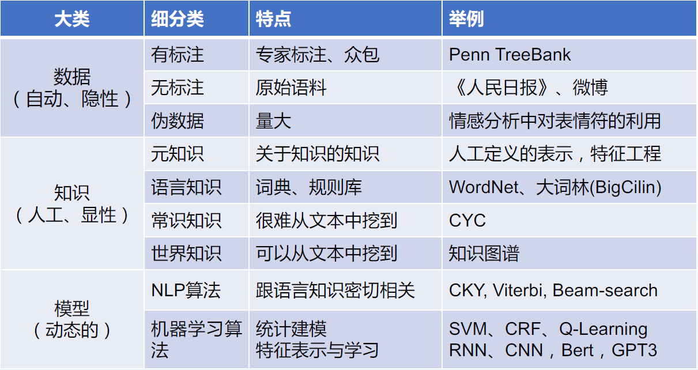

# 题型

填空，选择，计算（推理），简答

# 重点

## 第一章

**发展历史**（年份和事件）⭐【大题】

* “AI”的诞生：四位学者在1955年提出了人工智能这一术语及研究范畴。（1956年达特茅斯会议）

* 第一次浪潮（20世纪50年代末到70年代初）：机器的**逻辑推理**能力。人工智能主要用于解决代数、几何问题，以及学习和使用英语程序；

  * 1959年，牛津大学逻辑学家Wang Hao在一台IBM计算机上只用9分钟就证明了《数学原理》中超过350条的一阶逻辑全部定理；

  第一次低谷：受限于当时计算机算力不足，以及经验与数据量的不充足等因素，研发出的专家系统所能解决的问题非常有限，人们对AI发展的看法转为怀疑态度。

* 第二次浪潮(20世纪80年代初到90年代初)：特定领域的“**专家系统**”，能够根据领域内的专业知识，推理出专业问题的答案。专家系统所依赖的知识库系统和知识工程成为了当时主要的研究方向。

  * 1968年由费根鲍姆研发的DENDRAL系统，可以帮助化学家判断某特定物质的分子结构。

  第二次低谷：专家系统受限于领域的局限性、知识描述和生成的复杂性等因素，升级难度高、维护成本居高不下。

* 第三次浪潮(21世纪初至今)：**深度学习**加速人工智能普遍应用。AI应用层出不穷，科学研究进一步加深，助推AI呈现加速发展态势。

  * 2006年深度学习算法提出；
  * 2012年AlexNet在ImageNet训练集上图像识别精度取得重大突破，直接推升了新一轮人工智能发展的浪潮；
  * 2016年，AlphaGo打败围棋九段棋手李世石；2017年，AlphaGo以3:0比分完胜世界围棋冠军柯洁；
  * 2021年，AlphaFold用于预测蛋白结构。

**“人工智能”概念**：让机器能像人那样认知、思考和学习，即用计算机模拟人的智能。人工智能是以机器为载体实现的人类智能或生物智能。⭐

**人工智能主流方法**⭐

1. 以符号主义为核心的逻辑推理
2. 以数据驱动为核心的机器学习
3. 以行为主义为核心的强化学习
4. 以问题求解为核心的探寻搜索
5. 以博弈对抗为核心的决策智能

## 第二章

作业复习：谓词推理⭐【计算题：和作业相同】

参考格式：

其中**改写**相当于逻辑等价式（虽然这里(3)和(4)其实是用c)推理出来的），**归结**则是运用推理规则：

（9） $p \or q, \neg p \or r \Rightarrow q \or r$

## 第三章

贪婪搜索与A*搜索，复习作业

## 第四章 机器学习

**有监督、无监督概念，二者区别，应用场景和经典方法**⭐

有监督和无监督学习均为机器学习，机器学习通过对数据的优化学习，建立能够刻画数据中所蕴含语义概念或分布结构等信息的模型。

监督学习的目标是从带有标签信息数据的训练集$D = \{(x_i, y_i)\}_{i=1}^n$，学习一个从输入$x_i$到输出$y_i$的最优映射（决策函数），实现数据的分类和识别；无监督学习则是直接从无标签数据$D = \{(x_i)\}_{i=1}^n$出发，通过数据自身的特征等来学习决策函数。

监督学习主要用于回归和分类，包括：

* 线性回归
* Bayes分类器
* 线性判别分析（支持向量机之类的）
* 决策树

非监督学习包括：

* K-means聚类
* 主成分分析
* 特征人脸（本质也是PCA）⭐【大题：结合PCA原理，详述人脸识别和编码的基本过程。】

**特征降维，PCA**

1. 数据规范化，得到数据矩阵$A_{m\times n}$（m个属性，n个样本）
2. 计算协方差矩阵$(m \times m)$
3. 计算协方差矩阵的特征值和特征向量
4. 取特征值从大到小排序前$l$个，得到特征变换矩阵$P_{l \times m}$
5. 用$P$对数据$A_{m\times n}$做变换，得到降维变换后的数据

**过拟合**

**泛化能力（generalization）**
在机器学习中，需要保证模型在训练集上所取得性能与在测试集上所取得性能保持一致，即模型具有泛化能力（generalization）。

## 第五章 神经网络

**神经网络和深度学习的关系**

深度学习模型受到了神经系统层次化结构特性的启发，以“层层递进、逐层抽象”机制来完成特定任务。在感知机（仅包含输入层和输出层的神经网络）的输入层和输出层之间加入多个隐藏层构成了深度神经网络。

**损失函数**

将映射函数记为$f$，第$i$个训练数据记为$(x_i, y_i)$以及$f$对$x_i$的预测结果记为$\hat{y_i}$（即$\hat{y_i} = f(x_i)$），可定义损失函数$Loss(f(x_i), y_i)$来估量预测值$\hat{y_i}$和真实值$y_i$之间差异。

**梯度下降法的思想**

沿损失函数梯度（上升最快的方向）的反方向更改神经网络系数的值，从而使损失函数下降到极小值。具体来说，令损失函数$E$对系数$w_i$求偏导$\frac{\partial E}{\partial w_i}$，然后让$w_i$减去$\frac{\partial E}{\partial w_i} \times \eta$，其中$\eta$为步长。

**BP神经网络的原理、推导**⭐【计算题】

包含两个阶段：

1. 正向过程。输入信息从输入层经中间隐藏层逐层计算各单元的输出值。
2. 反向传播过程。输出误差逐层向输入端传播，算出损失函数对每一层各系数的梯度（偏导），并用此修正前层权值。

步骤如下：

1. 神经网络先随机指定一系列参数$w$, 令前一层第$i$个单元到本层第$j$个单元的权重为$w_{ij}$, 则在本层第$j$个神经元处的输出计算如下：
   $$
   net_j = \sum_i w_{ij}O_i \\
   O_i = f(net_j)
   $$
   其中$f$为激活函数，可以是Sigmoid, ReLU, Tanh等。

2. 对于输出层，$\hat{y_i} = O_i$为实际输出。计算损失函数：
   $$
   E = \frac{1}{2}\sum_j(y_j - \hat{y_j})^2
   $$

3. 考虑权值$w_{ij}$对误差的影响，对$w_{ij}$求偏导，由链式法则可得：
   $$
   \frac{\partial E}{\partial w_{ij}} = \frac{\partial E}{\partial net_j} \times \frac{\partial net_j}{\partial w_{ij}}
   $$
   令$\delta_j = \frac{\partial E}{\partial net_j}$，则有：
   $$
   \frac{\partial E}{\partial w_{ij}} = \delta_j \times O_i
   $$
   使用梯度下降法，令权值参数沿偏导的反方向下降：
   $$
   \Delta w_{ij} = -\eta \delta_j O_i \\
   w_{ij}(t+1) = w_{ij}(t) + \Delta w_{ij}(t)
   $$
   如果$j$是输出单元，则有：
   $$
   \delta_j = \frac{\partial E}{\partial \hat{y_j}} \times \frac{\partial \hat{y_j}}{\partial net_j}
   = -(y_j - \hat{y_j}) \times f'(net_j)
   $$
   如果$j$不是输出单元，则$O_j$对后层的所有节点均有影响，因此：
   $$
   \delta_j = \sum_k \frac{\partial E}{\partial net_k} \times \frac{\partial net_k}{\partial O_j} \times \frac{\partial O_j}{net_j}
   = \sum \delta_k w_{jk} f'(net_j)
   $$

**卷积神经网络和循环神经网络的原理、关系、区别**（⭐选择）

CNN和循环神经网络的区别：CNN捕捉空间特征，用于图像处理；RNN捕捉时间序列特征，用于语音信号、文本序列等数据的处理

**循环神经网络**

在隐藏层上有一个循环连接，用于在输入数据中加入当前时间步的信息，使输出信号基于当前时刻的状态，从而在神经网络中引入了时序概念

**长短记忆神经网络**

用于解决一般循环神经网络中普遍存在的长期依赖问题，使用LSTM可以有效传递和表达长时间序列中的信息并且不会导致一段时间前的有用信息被忽略（遗忘）。

## 第六章 强化学习

强化学习：一类描述和解决智能体在与环境的**交互**过程中通过学习策略以达成回报最大化或实现**特定目标**的机器学习方法。

**相关概念**（需要结合具体的例子）⭐【大题：简述强化学习原理，结合生活实例介绍】

* 智能体（Agent）：学习并作出决策的主体。
* 环境（Environment）：外界的、与智能体交互的对象/环境。
* 策略（Policy）：智能体的行动规则，是从当前状态到下一步行为的映射。
* 奖励信号（Reward Signal）：是一个反馈信号标量，用于表示在第t步智能体的行为怎么样。从而定义了强化学习的目标：最大化累积奖励。
* 价值函数（Value Function）：对未来奖励的预测，用于评估状态与行为的好坏。
* 模型（Model）：对环境的预测，用于智能体的规划。

以训练人工智能走迷宫为例：

正在训练的人工智能是智能体；它所处的迷宫，包括墙、地面、起点和终点是环境；它在每一步根据当前状态决定下一步行动的规则是策略，例如：如果前方有墙壁，就向左转向；如果没有，就直走；奖励信号是人工智能做出一个行动后得到的反馈，人工智能以最大化累积奖励为目标，例如每过一个时间步都会得到-1奖励信号，行动步数越多负反馈越大，这样会使人工智能尽可能减小行动的步数；价值函数用于预测未来奖励，例如以当前所处位置到终点步数的负值作为价值函数，价值函数越大的状态越接近目标，这可以帮助AI评估每个可能的动作的长期效果，以便选择最佳的动作；模型是对环境的理解或预测，例如，AI可能会学习到，如果它面向墙壁并尝试前进，它将保持在原地。

## 第八章 人工智能伦理与安全

⭐【大题：人工智能在伦理和隐私方面存在哪些问题？有什么治理措施？】

**治理对象**

1. 技术维度（原生问题）：数据、算法、算力
   * 数据：训练人工智能需要大量数据，涉及到数据来源是否合法、数据资产属性的相关问题、数据是否侵犯隐私、数据知识产权问题等
   * 算法：科学性和有效性，是否得到了正确合理的应用
   * 算力：人工智能的蓬勃发展带来对算力需求的指数增长，而这与算力提升放缓形成矛盾
2. 社会维度（衍生问题）：AI对社会、政治和法律均有影响
3. 发展维度：目前的AI仍处于弱人工智能阶段，没有脱离人类成为自主性的个体，仅具有某一方面的类人特征，不具备成为法律主体的基本依据；而未来AI可能发展为强人工智能，无需借助人类的力量，拥有“自由意志”，可能在特定领域取代人类，需要通过伦理、法律等对其发展进行规范。

**治理手段**

1. 伦理——基础性治理工具

   机器权利与人权：保证系统的设计和运作应符合人类的尊严、权利、自由和文化多样性，不侵犯人权。

2. 政策——灵活性治理工具

   采用渐进、务实和谨慎的方法，促进人工智能发展，不扼杀创新，同时保障人类的利益，确保人工智能系统在部署前必须能够对其决策产生完整和令人满意的解释

3. 法律——强制性治理工具

   机器本身的地位和行为属性界定，机器与人的关系，机器、人与物的关系都要重新进行认识和制度化确定

   个人数据隐私保护、知识产权保护

4. 技术——根本性治理工具

   提供更高效的、科学的算法，合理提升AI性能，使未来人机和谐发展共生

**治理方法**（大概看看）

* 弹性包容的治理理念
  * 积极推进研究和各种准备工作，保持政府监管的灵活性和保留创新和发展空间

* 构建不同阶段的治理路径
  * 近期加快制定产品和服务的标准，加强数据治理
  * 中期加强调整法律制度，实现法律和伦理的对接
* 重视软法性、自治性规范
  * 尽管目前制定综合性立法的条件尚不成熟，但各国政府无一例外地积极支持和鼓励“伦理指南”等软法性、自治性规范的研究和制定。这些软法性、自治性规范尽管当前并没有强制性法律效力，但其中的许多原则和规则指出了未来可能的监管方向，并且极有可能在未来立法条件成熟时转化为具有强制力的法律规定。
  * 建立“监管沙箱”制度。即对于新兴的产品或服务，政府先通过简化市场准入和标准和程序，先允许在一定范围内快速落地进行测试和验证的方式。
* 建立和保持与产业界、学术界的沟通协商机制。
  * 建立和保持与产业界、学术界的沟通协商机制，有助于政府更快更好地掌握相关领域的专家知识，随时了解相关领域的最新发展动态和需求，并集合多方的智慧为政府监管提供有益的见解。
* 加强国际交流
  * 共享发展、公平发展、开放发展、和谐发展

## 自主无人系统

**无人系统的定义**：集**感知、定位、决策、控制**于一体，由**地空平台、任务载荷、指挥控制系统及天空-地面信息网络**等组成的综合系统（填空题）⭐

**无人系统有哪些**

* 自动无人系统：只能按照先验的程序工作，难以适应环境的动态变化
* 智能无人系统：系统不仅限于预先设定的步骤和程序，具有一定的感知、决策、定位和控制能力，在人为有限干预或者环境引导下可以自主作业
* 自主智能无人系统：无人系统具有高度的自主性、智能性、学习性、协同性，在许多任务上具有仿人的智力和能力

## 自然语言处理

**自然语言处理的概念**

自然语言是指人们所说的语言。自然语言处理是计算机科学、人工智能和计算语言学领域的交叉学科，探讨计算机如何理解及运用自然语言，目标是构建能够像人类一样与人类互动的智能计算机。

**三要素**

**四类任务**⭐

结构预测、匹配、分类、生成

