# 01 导言

**软件定义**：程序 (+ 数据) + 文档

**软件的特点**：

1. 软件是无形的、不可见的逻辑实体
   * 正确与否，一直到程序在机器上运行才能知道
   * 给设计、生产和管理带来许多困难
2. 软件是设计开发的，而不是生产制造的
3. 软件在使用过程中没有磨损、老化的问题
4. 软件是定制开发的

   * 虽然整个工业向着基于构件的构造模式发展，然而大多数软件仍是根据实际的顾客需求定制的
5. 软件的开发成本高
6. 软件易于复制

**分类**：

* 按功能：

  * 系统软件
  * 支撑软件
  * 应用软件

* 按规模：小型中型大型

* 按服务对象：项目软件，产品软件

**开发过程**：从问题空间 (所面临的特定问题域) 到解空间 (代码、文档) 的知识转换过程。
问题抽象 > 抽象问题理解 > 编写程序 > 部署运行

**典型软件项目**：分析，设计，编码，测试，维护

**诞生原因**：软件危机（进度难以预测，开发成本难以控制，⽤户对产品功能的要求难以满足，软件产品质量无法保证，软件产品难以维护）

**软件工程的定义**：以工程的原理、原则和方法进行软件开发

**关注点**：质量、成本、时间、功能。
相互冲突制约，需要权衡。

**内容层次**：工具（自动化完成软件工程）、方法（总结出一些模式）、过程（规范化）、质量关注点

# 02 软件过程

## 软件过程

**定义**：软件过程定义了软件组织和人员在软件产品的定义、开发和维护等阶段所实施的一系列活动（Activity）和任务（Task）。软件过程是一个为创建高质量软件所需完成的活动、动作和任务的框架。

**生存周期**

1. 定义阶段：问题定义，可行性研究和需求分析
2. 开发阶段：软件设计，程序编写，软件测试
3. 运维阶段：运行，维护

**开发模型**

对开发人员所采用的软件开发方法与过程组织整体结构的抽象描述。

经典开发模型：

1. **瀑布模型**：将软件开发的各个过程以==线性的、顺序的==方式进行【考了小题】

   主要问题：实际项目很少完全遵循。客户难以在一开始准确描述需求。可执行软件交付太晚。

2. **增量模型**：开发过程分成若干增量，每次只取最核心的需求，以迭代的方式使用瀑布模型

   客户反馈比瀑布模型更加及时，但缺少针对每次增量的时间和范围的指导建议

3. **演化模型**：通过周期性的迭代将各个阶段以螺旋扩增的方式进行编排。

   “原型”：客户与开发团队之间有效沟通的重要技术手段

4. **统一过程模型**：增量、迭代的过程流，每个迭代涉及核心过程工作流和核心支持工作流中的多个过程。在不同阶段，迭代工作流中的过程工作量是不同的。

## CMM与CMMI

软件供应商能力评估模型。

CMM: Capacity Maturity Model. 在此基础上集成相关模型逐步形成CMMI。

* ==五个成熟度等级==：初始级、已管理级、已定义级、量化管理级、优化级【考了判断题】
* 22个过程域，每个成熟度等级中包含一组相关的过程域（表示需要具备相应的能力）
* 每个过程域内部定义了不同的能力等级（0-3）

## 敏捷开发

**开发原则**：适应变化，快速迭代；持续不断地、及早地交付有价值的软件；只做增量的短期计划并根据变化和反馈不断进行调整；业务人员和开发人员在整个过程中紧密合作；倡导可持续开发。

* 我们的最高优先级是持续不断地、及早地交付有价值的软件来使客户满意
* 拥抱变化，即使是在项目开发的后期，愿意为了客户的竞争优势而采取变化
* 经常地交付可工作的软件，相隔几星期或一两个月，倾向于采取较短的周期
* 业务人员和开发人员在整个过程中紧密合作
* 围绕着被激励的个体构建项目，为个体提供所需的环境和支持，给予信任，从而达成目标
* 在团队内和团队间沟通信息的最有效和最高效的方式是面对面的交流
* 可工作的软件是衡量进度的首要标准
* 倡导可持续开发，项目发起者、开发人员和用户应该维持一个可持续的步调
* 持续地追求技术卓越和良好设计，可以提高敏捷性
* 以简洁为本，它是减少不必要工作的艺术
* 最好的体系结构、需求和设计是从自组织的团队中涌现出来的
* 团队定期地反思如何变得更加高效，并相应地调整自身的行为

**与精益思想的区别**

敏捷思想强调可持续的开发步调，定期反思如何变得更加高效；精益思想强调避免超负荷工作，重视系统和过程的持续改善。二者有相似的价值观，但敏捷思想的产出更有针对性，价值交付更密集，目标是通过小的迭代使开发过程更灵活。

**DevOps**：开发运维一体化

将敏捷的精神延伸到运维阶段，包含贯穿软件开发和运维的一系列实践集合。

Dev：

* 快速迭代的增量开发
* 持续的自动化测试
* 持续集成

Ops：

* 频繁部署
* 持续的质量和性能监控
* 快速的反馈和改进机制

**CI & CD**

* 持续集成，Continuous Integration，简称CI。开发人员频繁地将代码变更提交合并到中央存储库，并**自动运行构建和执行单元测试**，从而确保新代码可以和原有代码正确地集成在一起。使正在开发的软件始终处于可工作状态，更快地发现、定位和解决错误，提高软件质量，减少验证和发布新软件所需的时间。
* 持续交付，Continuous Delivery，简称CD。任何代码变更提交后都能够自动运行构建和执行单元测试，自动将所有代码变更**部署到测试环境和类生产环境**。让正在开发的软件始终处于可部署状态同时实现快速交付，能够应对业务需求，并更快地实现软件价值。
* 持续部署，Continuous Deployment，简称CD。任何代码变更提交后都能够自动运行构建和执行单元测试，自动将所有代码变更部署到测试环境、类生产环境以及**生产环境**。实现从代码变更提交到生产环境部署的全流程自动化而无需人工干预。加快代码提交到功能部署的速度，并能快速地收集真实用户的反馈。


# 03 版本与开发任务管理

## 版本管理

版本管理的任务：

* 将各种软件制品都置于系统性的管理之中，进行版本标识
* 追踪演化历史
* 确保开发人员在并行协作开发过程中不会相互影响

==**版本控制系统**==【考了大题】

* 集中式版本控制系统：版本库集中存放在中央服务器上。

  缺点：必须联网才能工作，服务器单点故障影响整个团队，容易发生版本数据丢失

* 分布式版本控制系统：每个开发人员的客户端机器上都存储着完整的版本库

  优点：无需联网工作；版本库数据可以从任何本地库恢复，可靠性高；灵活、强大的分支管理

  

**代码分支管理**：用于支持多个并行的互不干扰的分支，避免不同开发人员的提交混杂在一起，版本变得混乱，导致项目难以进行持续集成和发布。

## 开发任务管理

**变更管理**

客户需求变化，市场或技术因素发生变化等。需要一种规范、系统和可控的方式来管理软件变更流程，确保规范性和可追踪性。

流程：

1. 提交变更请求：来源，原因，内容；
2. 变更决策：由CCB（变更控制委员会）执行，讨论并评审变更的合理性、影响范围、实现工作量；
3. 变更的实施与追踪：发起特性开发任务，或事务性任务
4. 变更归档：记录变更从请求到实施与跟踪的整个流程，便于变更的问题追踪

**缺陷修复管理**

开发人员或测试人员在开发或测试过程中发现的缺陷、用户在使用过程中发现的缺陷。

需要实现缺陷修复的有效管理和追踪，否则缺陷修复过程将变得混乱，例如缺陷的职责分配不清、缺陷修复的进度无法监控等。

1. 描述缺陷的现象、复现缺陷的步骤等
2. 评估缺陷的优先级和重要程度
3. 指派修复缺陷的负责人
4. 与相关开发人员讨论缺陷的修复方案
5. 跟踪缺陷的处理状态
6. 关联修复缺陷的代码提交

## 发布管理

**基于追踪的分析**：==燃尽图==【考了选择】

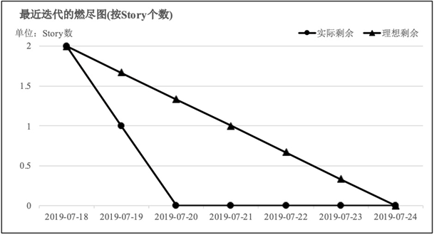

- 横轴：显示工作天数
- 竖轴：显示剩余工作
- 计划剩余工作曲线：该曲线实际上是一条直线
- 实际剩余工作曲线：该曲线受团队实际工作效率的影响，在计划曲线上下浮动

**基于回溯的分析**

**SIPOC**：沿着流程找原因，清晰完整地展现出流程细节，用简洁直观的形式表现出流程的结构概况，为后续的分析奠定基础

* S：供应商（Supplier）
* I ：输入（Inputs）
* P：流程（Process）
* O：输出（Outputs）
* C：客户（Customer）

**鱼骨图**：针对一个问题（作为鱼头），由回溯小组经过充分讨论列明产生问题的大原因（鱼骨主干上的分支），从大原因继续反复论证，列举出每个大原因产生的中原因，中原因再论证小原因，如此一层层论证分析下去，直到找出所有可能的原因

**5why分析方法**：对一个问题连续问5个“为什么”以追究其根本原因。实际使用时，不限定只问5个“为什么”，主要是必须找到根本原因为止。

# 05 软件定义、软件设计

## 软件设计

**层次**

* 概要设计
  * 体系结构设计：决定系统的高层分解结构以及各种全局性的设计决策（如开发语言、异常处理策略）
  * 数据设计：软件的全局数据结构设计，包括数据实体及其属性和相互之间的关系
* 详细设计
  * 组件接口设计：组件之间的交互接口设计，包括接口的功能和非功能性（如性能、吞吐量）要求、接口交互协议、接口操作及实现类定义等
  * 组件级设计：组件内的具体设计方案，例如类及类之间关系、组件内部的局部数据结构和算法设计等

**软件设计思想**：

* **分解与抽象**

  分解：将软件不断地分解为更细粒度的代码单元

  抽象：忽略无关细节，只保留与当前问题相关的关键信息，突出事物本质属性。分为数据抽象和过程抽象。

  好的抽象：屏蔽底层细节，突出事物的本质特性。能极大提高程序的可迁移性和可复用性。

* **软件体系结构**：软件系统的顶层设计方案，充分体现分解与抽象的基本原则

* **关注点分离**：将软件系统的整体需求分解为尽可能小的关注点并分解到不同的模块单元（例如模块、包、类、方法等）中实现

  关注点：软件系统中所实现的某种功能或特性，反映不同涉众所关注和关切的方面

* **模块化**：将整个产品或系统分解为大小合适、相对独立的模块，分解和抽象的集中体现

  高内聚、低耦合

* **信息隐藏**：将实现细节隐藏在内部，仅通过受限的接口对外提供访问

* **重构**：在不改变代码外在行为的前提下，对代码作出修改以改进程序的内部结构（改进设计）

  目的：提高软件的可维护性和可扩展性。

  敏捷开发：演化式设计，随着迭代化的开发过程逐步完善设计

* **复用**：在不同软件系统中或同一软件系统的不同部分重复使用相同或相似的软件代码、软件设计或其他相关的软件知识

## 面向对象的软件设计

**设计过程**

1. 识别设计类：是否包含多个同类对象所**共有的**且是当前软件系统所**需要的**属性及相关操作

2. 明确设计类职责和协作

   流程：

   1. 类的职责分配：确定软件的**类分解结构**及**类间的边界**
   2. 按照**高内聚**、**低耦合**的标准衡量每个类的独立性并进行调整
   3. 进一步降低类间耦合
   4. 确定类间的协作关系

3. 细化设计类内部细节：类属性，方法，内部数据结构和算法

**UML**

* 静态结构：类图

  ``` mermaid
  classDiagram
  classA <|-- classB
  interfaceM <|.. classN
  classC *-- classD
  classE o-- classF
  classG <-- classH
  classK <.. classL
  ```

  从左到右：

  1. Inheritance，继承，B为子类，A为父类，表示泛化和特化关系
  2. Realization，实现，类N实现接口M的功能
  3. Composition，组成，“强”的整体与部分的包含关系（D is a part of C）。成分类必须依靠合成类而存在。
  4. Aggregation，聚合，“弱”的包含（" E owns a F" ）关系，成分类可以不依靠聚合类而单独存在。
  5. Association，关联，一种强依赖关系，是一种长期的稳定的关系，" H has a G" 。也可能没有箭头，也可能双箭头。
  6. Dependency，依赖，表示调用、属性访问等

* 动态交互关系描述：顺序图

  

  交互参与方：用圆角矩形表示，一般是相关设计类的实例对象

  时间线：参与方下面的虚线，从上到下表示时间先后顺序

  激活条：时间线上的矩形条，表示参与方在此期间处于激活状态

  消息：不同参与方之间的横向箭头

  * 同步请求消息：用实线三角形箭头表示（参与方发出请求消息后阻塞等待）

  * 同步调用的返回消息：用虚线线型箭头表示

  * 异步请求消息：用实线线型箭头表示（参与方发出请求消息后不进行阻塞等待）

* 行为设计：状态机图

  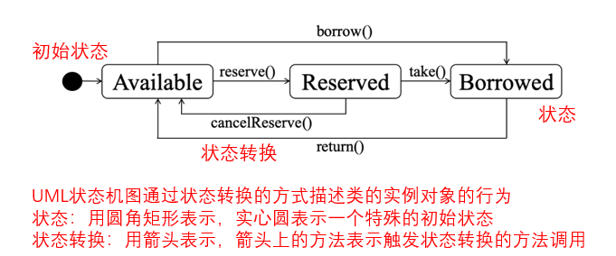

**内聚和耦合**

* 高内聚：模块职责应明确专一，包含的内容都是职责密切相关、不可或缺的部分
  * 功能内聚：模块仅执行单个计算任务并返回结果，并且不存在任何副作用
  * 层次内聚：模块中仅包含一组密切相关的功能或服务，这些功能或服务形成一个严格的层次结构，其中高层可以访问较低层次上的功能或服务，反之则不行。
  * 通信内聚：模块中仅包含访问同样一组数据的操作。
* 低耦合：模块间依赖尽可能少，理解和修改一个模块时不用过多考虑其他模块，修改后对其他部分的影响较小
  * 内容耦合：一个模块具有偷偷修改另一个模块内部数据的能力，因此对其内部的内容产生了耦合。
  * 共用耦合：多个模块共同访问同一个全局变量，造成这些模块之间以及与定义全局变量的模块之间的耦合
  * 控制耦合：一个过程（方法或函数）通过传入“标识位”或“命令”的方式调用另一个过程并对其执行过程进行了相应控制

**设计原则**（SOLID）

* 单一职责原则（Single Responsibility Principle）：每个类、接口、方法都应该只具有单一的职责，应该只会因为一个原因发生变化

* 开闭原则（Open Closed Principle）：对扩展开放、对修改封闭

* 里氏替换原则（Liskov Substitution Principle）：子类对象可以出现在任何父类对象出现的地方

* 迪米特法则（Law of Demeter）：强调不要和“陌生人”说话，只与直接“朋友”交谈

  每个类的直接“朋友”包括作为其属性、方法参数或返回值的对象

* 接口隔离原则（Interface Segregation Principle）：多个服务于特定请求方的接口好过一个通用接口

* 依赖转置原则（Dependence Inversion Principle）：强调应该尽量依赖于抽象（例如抽象类、接口）而非具体（例如具体的实现类）

## 设计模式

| 模式分类   | 分类含义                                                     | 设计模式     |
| ---------- | ------------------------------------------------------------ | ------------ |
| 创建型模式 | 与类的实例对象创建相关的设计模式，关注于对象创建过程的抽象和封装 | 单例         |
| 结构型模式 | 与类和对象的结构组织相关的设计模式，关注于如何实现对象的组合 | 适配器、组合 |
| 行为型模式 | 与类和对象之间的交互行为和通信相关的设计模式，关注于类和对象之间的交互关系和职责分配 | 策略、观察者 |

# 06 软件复用

**组件级复用**

* 目的：实现特定功能和特性

* 形式：软件组件（或称软件构件）
  * 软件组件实现特定的功能并明确定义了API，软件开发人员可以通过API调用的方式复用相关的功能实现

* 按照可复用范围分为三类
  * 一方库：当前项目内的通用功能模块
  * 二方库：同一企业内所积累的通用功能模块
  * 三方库：由开源社区或企业所提供的广泛授权使用的通用功能模块

**框架级复用**

* 目的：获得支撑应用运行的整体性框架
* 形式：各种软件开发框架
* 在**共性实现**的基础上支持**定制**和**扩展**
* ==与组件级复用的区别==【考了大题】
  * 组件级复用：应用代码通过调用组件的API实现复用
  * 框架级复用：按照框架规范实现的应用代码被框架调用，经常会用类似于依赖注入的设计思想

**组件、模式与框架复用的差别**

* 软件组件

  针对特定功能提供可复用的实现，开发人员在自身已有的实现方案基础上调用组件实现局部功能

* 设计模式

  一种抽象的设计思想，往往体现为参考设计方案（如用UML图表示），本身并没有代码实现，需要针对具体问题、参考其设计思想进行实现

* 软件框架

  本身包含相对完整的设计以及核心实现，提供扩展和定制能力，开发人员针对特定应用的实现通过扩展点插入框架中，一般由框架来调用形成完整的应用实现

# 07 体系结构

**内容**

* 软件组件：哪些软件组件会参与集成并构成最终的软件系统
* 软件组件的外部属性：其他组件可以如何对该组件的功能接口、处理性能和响应时间等做出假设
* 软件组件间的关系：组件之间如何装配集成、在特定场景下协作
* 全局的实现约定：不同组件之间在实现语言、异常处理策略、共享资源的使用方式、包和文件的命名方式等方面保持一致

**设计过程**：表现为分层的决策过程

==**体系结构描述**：4+1视图==【考了简答】

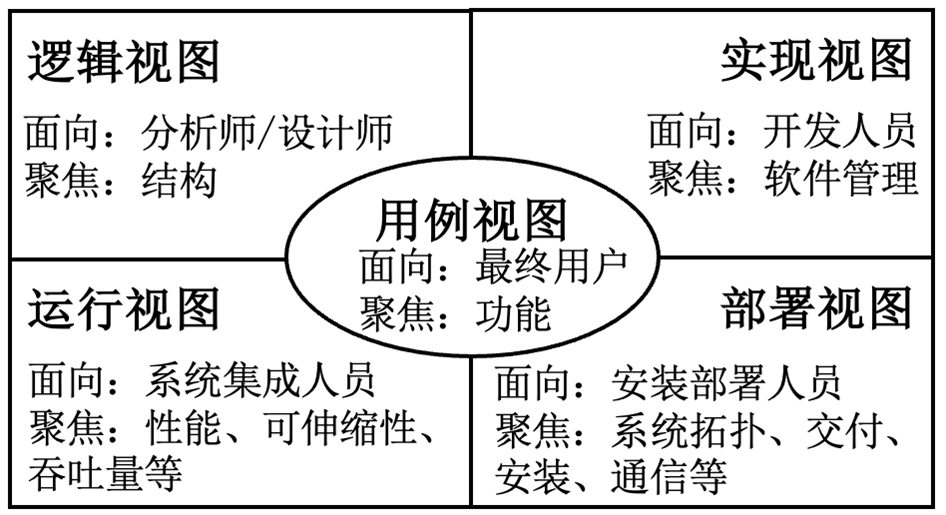

| 视图     | 面向               | 内容                                                         | 描述         |
| -------- | ------------------ | ------------------------------------------------------------ | ------------ |
| 用例视图 | 用户               | 软件功能，软件系统与外部参与者间交换序列的场景描述           | 用例图       |
| 逻辑视图 | 软件分析和设计人员 | 软件的业务模型及逻辑分解结构                                 | 类图，组件图 |
| 实现视图 | 开发人员           | 软件管理，如何分解实现以及构建得到最终交付制品               | 包图         |
| 运行视图 | 系统集成人员       | 组件之间的动态交互行为，并发和同步设计；分析系统的性能、并发性、可伸缩性、吞吐量 | 顺序图       |
| 部署视图 | 安装部署人员       | 软件系统如何交付并部署到运行环境中                           | 部署图       |

**体系结构风格**

* 层次化：通过层次划分将功能实现分解到不同层次上，通过层间接口对每个层次的内部实现进行抽象

* 知识库：以数据为中心，围绕知识库的一组软件组件通过共享知识库间接进行交互

  缺点：当中心知识库数据量大到一定程度之后，难以实现高效的数据访问和管理

* 管道-过滤器：一种数据流体系结构

## 分布式体系结构

**设计原则**

* CAP定理：对于同时存在数据读取和更新操作的分布式系统，一致性（Consistency）、可用性（Availability）、分区容错性（Partition Tolerance）三个属性无法同时被满足。

  * 一致性：数据更新后，任何一个客户端、在任何时候都能读取到最新的数据，就好像这些数据只有一份统一的拷贝放在一个节点上
  * 可用性：向一个非故障状态节点发出的请求，总是可以在合理的时间内返回正确的响应（但所返回的数据可以不是最新的）
  * 分区容错性：系统中某一个节点或网络分区发生故障后，系统仍然能够对外正常提供服务，这意味着系统的多个网络分区中都部署了数据和服务副本

  可用性和容错性是必要的，通常牺牲一致性。

* BASE原则：牺牲数据的强一致性，换取高可用性，并在最后能实现最终一致性

  * 基本可用：不追求绝对的系统可用性，而是允许在服务质量有所下降（服务降级）的情况下确保基本的可用性

  * 软状态：又称弱状态，允许系统中不同节点上的数据处于一种**不一致的中间状态**，即不同节点上的数据更新可以存在一定的时间差

  * 最终一致性：系统中不同节点上的数据副本经过软状态的过渡后，最终都能够达到一致的状态

  BASE原则和最终一致性的思想使得分布式软件体系结构设计具有了更大的灵活性。

**相关软件技术**：

  * **进程间通信**

    模式：一对一同步，一对一异步，一对多异步

    异步通信实现：基于消息的通信，使用消息队列实现

    消息通道模式：

    * 点对点：发送方和接收方进行一对一通信，消息仅有一个接收方（即消费者），消息被读取处理后从队列移除。用于数据、命令。
    * 发布-订阅：消息的发送方和接收方进行一对多的通信，发送方发布的每条消息都会标注相关的话题（Topic），接收方按照话题进行订阅并接收消息。用于事件。

  * **负载均衡**：将大量请求负载以一种合理、均衡的方式分配到不同的服务器上

  * **分布式存储**：实现高效的数据存取。部署在由多台服务器组成的集群上，一般采用主从结构进行组织；对外提供统一的文件访问（例如创建、读取和更新文件），客户端无需了解内部结构。

  * **可靠性保障**：分布式软件系统面临外部不可预知的访问负载以及内部网络和服务器的各种不确定问题。体系结构层面上的可靠性保障策略建立在软件工程所蕴含的综合权衡的思想基础上。包括**限流、降级、熔断**等。

## 微服务体系结构

**定义**：微服务架构风格将单个应用程序实现为一组小的服务，每个服务在自己的进程中运行，并通过轻量级机制进行通信。这些服务是围绕业务功能构建的，可以通过完全自动化的部署机制独立部署。这些服务去集中化管理，可以使用不同的编程语言编写并使用不同的数据存储技术。

**容器**：比虚拟机更现代和轻量级的虚拟化机制。物理机上的一种特殊进程，无需运行自己的操作系统。

容器实例之间相互隔离且都具有自己的IP地址，在其中运行的进程就像在独立的机器上运行一样。

**容器化部署**：容器允许开发者将应用及其环境一起打包成为容器镜像（Image），并作为一个整体进行部署。提供软件应用（服务）运行环境，是微服务部署的绝佳选择。

# 08 软件需求

**来源**：来自于与待开发系统相关的多个方面的人或组织

涉众：

* 用户：使用系统的人或组织
* 客户：组织系统开发并支付费用的人或组织（与用户不是一个概念）
* 系统集成商：负责将目标软件系统与其他应用软件、软硬件、网络基础设施集成在一起的人或组织
* 软件工程师：参与软件设计、开发和测试等任务的工程师
* 销售人员：负责软件产品市场销售的人员
* 公众与监管机构：可能受到目标软件系统影响的公众以及代表公众利益的监管机构

**类型**

* 功能性：系统应提供的服务，对特定输入的响应，在特定情形下的行为，系统不应做什么
* 质量：性能，可靠性，安全性，易用性
* 约束：产品约束，过程约束

**需求工程过程**

* 需求获取：

  * 识别相关涉众及文档资料、相关系统等其他需求来源
  * 获得各种需求信息
  * 建立对于待开发系统的初步理解

* 需求分析：场景分析，类分析，行为分析

  * 愿景分析和细化

  * 优先级排序
  * 冲突识别和协商

* 需求描述：

  * 场景分析与描述
  * 类分析与描述
  * 行为分析与描述

* 场景分析文本需求描述是否符合标准格式要求、是否完整、准确地反映了相关涉众的期望和要求

**需求管理**

* 需求追踪管理

  前向：与来源的关系

  后向：与设计、实现、测试的关系

* 需求复用管理：在多个不同的软件开发项目中，复制相同的需求及相关软件产品。建立跨项目的需求复用库。

* 需求变更管理：以一种规范化的方式保障需求变化能够平稳、可靠地实施。包括请求评估，决策，实现，验证，发布。

**用户需求、系统需求、软件需求**

* 用户需求：用户的期望
* 系统需求：开发方与用户、客户协商后达成的关于系统所要提供的服务、实现的功能及相关约束的一致意见。可作为开发合同的一部分。
* 软件需求：系统需求中对软件功能、质量和约束等方面的描述

**需求分析与描述**

* 场景分析与描述。用例图。

  用例(use case)：具有相同目标，交互过程相似(仅在部分步骤上有区别)的一组场景

  用例识别-参与者识别：人，外部设备，外部系统，定时器

  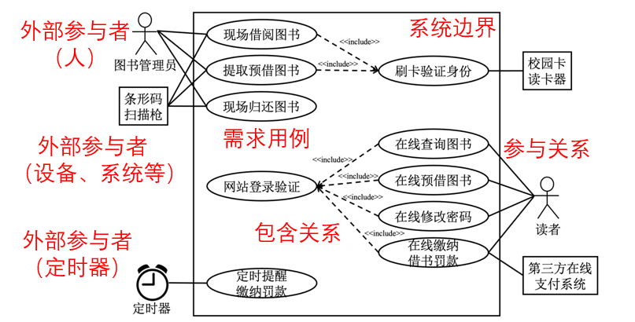

* 类分析与描述：参考面向对象软件设计-设计过程。类图。

* 行为分析与描述：确定合适的行为主体；再进一步识别事件、状态、状态转换以及相关动作。状态机图。

* 需求文档：主要通过自然语言进行书写，同时穿插图表和其他形式化描述

**敏捷开发中的需求工程**：需求变化非常快，不使用正式的需求文档，而是经常增量地收集需求并以用户故事(User Story)的形式写在卡片或白板上

==**用户故事与需求用例的关系**：==【考了名词辨析】

二者都是从用户角度陈述需求。

区别：

* 范围：需求用例覆盖的范围一般更大一些，用户故事需要适应敏捷迭代开发的需要，因此一般需要对所覆盖的范围和内容进行限制，以便进行任务安排和调度
* 生命周期:需求用例通常是永久性的工作制品，而用户故事具有短时性，往往仅在所属的迭代中发挥作用
* 目的：用例是为了让开发人员与客户或用户代表一起进行讨论并就需求达成一致，而用户故事的目的是为了发布迭代开发和交付计划，并引导客户和用户提供更多细节

在敏捷开发中，需要基于INVEST原则将一些较大的需求用例转化为多个用户故事

# 09 软件测试

**基本原则**

* 测试只能揭示软件中的缺陷，并不能证明软件的正确性
* “不存在缺陷的系统就一定是有用的系统”是一个谬论

**高可靠与高可用**

高可靠：很少出故障

高可用性=高可靠性+高可维修性

## 过程模型

**V模型**：与瀑布模型配套。测试在编码后进行

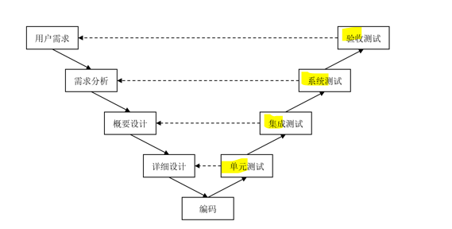

**W模型**：V模型上增加了各个软件开发阶段中同步进行的验证（verification）和确认（validation）活动，简称V&V

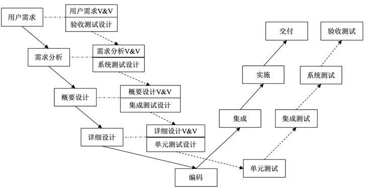

**敏捷测试模型**：测试活动不再是一个个独立的阶段，而是随着迭代化过程持续进行的活动

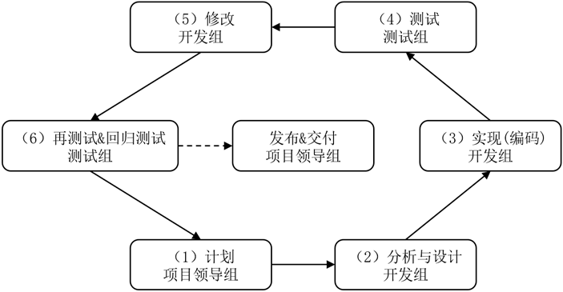

## 测试类型

**单元测试**：针对类、模块等代码单元的测试

**集成测试**：针对不同类、模块逐步集成及相应的测试

多个通过测试的代码单元组合在一起不能保证没有问题，因为代码单元可能对相互间的接口理解不一致。

策略：

* 大爆炸式（Big Bang）：将所有通过单元测试的软件单元、一次性地按照设计方案集成到一起进行测试
* 自顶向下：以主控单元为起点，自上而下按照深度优先或者广度优先的次序逐个组合各个软件单元，每次组合一个新的软件单元时执行一次集成测试
* 自底向上：从软件层次结构最底层单元开始进行组装和集成，每组合一个新的软件单元就进行一次集成测试
* 三明治：混合的渐增式策略，综合了自顶向下和自底向上两种集成策略的优点

**系统测试**：将整个软件系统作为一个整体，考虑具体系统运行环境

类型（与软件需求相似）

* 功能
* 性能
* 可靠性
* 兼容性
* 易用性
* 信息安全性

**验收测试**：确认整个软件系统是否完成用户提出的需求

## 测试方法

**黑盒**

功能测试，数据驱动的测试。适用于单元测试、集成测试、系统测试、验收测试等不同层次的测试。

* 等价类划分：将程序的输入划分为一组等价类

  * 有效等价类：合法输入集合
  * 无效等价类：非法

* 边界值分析：在等价类划分基础上，(作为补充)围绕它们的边界设计测试用例

* 判定表：基于参数组合进行分析的测试技术。输入条件+预期输出动作

  • 条件桩：列出问题的所有判断条件

  • 动作桩：针对问题可能采取的所有操作

  • 条件项：针对所有条件桩的具体取值组合，其中每个条件桩可以取true或false

  • 动作项：针对每一个条件项应该采取的动作桩组合

  • 规则：条件项和动作项的每一个组合形成一条规则

* 错误推测：测试人员根据经验、知识和直觉来推测程序中可能存在的各种错误，从而开展有针对性测试。一般作为辅助手段。

**白盒**

结构测试或逻辑驱动的测试。常被用于单元测试，特别是核心关键模块。

* 语句覆盖：每条可执行语句都能被执行至少一次
* 分支覆盖：每个判定的true分支和false分支都能被执行至少一次
* 条件覆盖：每个判定的原子条件可能取值至少满足一次
* 分支-条件覆盖：分支覆盖与条件覆盖的结合
* 条件组合覆盖：所有原子条件及整个判定的取真和取假都能满足
* 路径覆盖：覆盖所有路径，但未必能覆盖所有条件组合

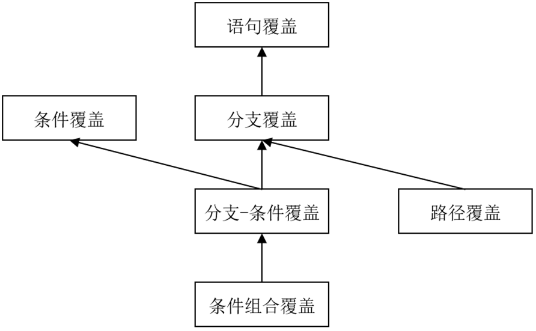

# 10 软件集成与发布

**高效软件交付的基本原则**

* 创建可重复且可靠的过程。尽可能多地采用自动化工作，将所有涉及到发布和部署的内容纳入版本控制系统的管理，实现对自动化脚本版本变化的追踪管理
* “已完成”即“已发布”。以发布和交付作为任务完成的标识
* 交付是所有人员的责任。开发人员、测试人员和运维人员尽早参与到软件发布过程中，共同面对交付和部署中的困难。
* 内建质量和持续改进。内建质量来自精益思想，强调在过程中更早发现并解决问题；定期召开回顾会议进行分析和总结，持续改进发布过程。

**蓝绿部署**：

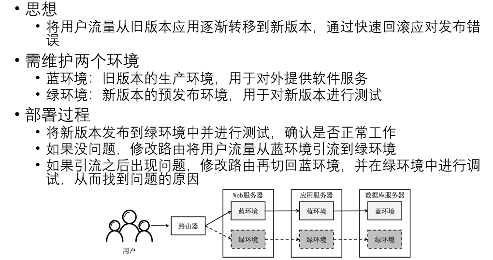

**金丝雀发布**

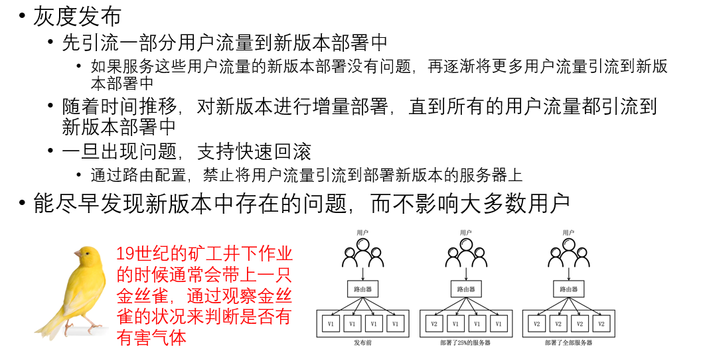

**暗发布**

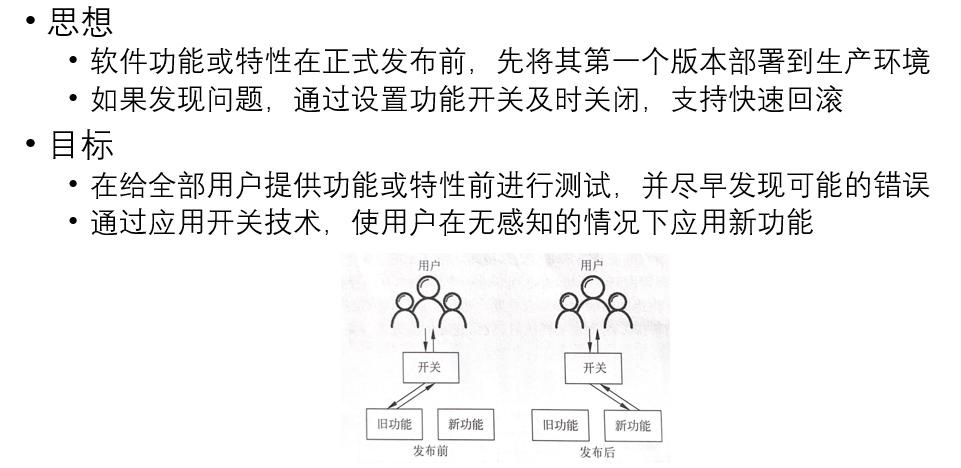

# 题

网上找的，有些是我根据网上的题改的，不一定对，看看就好。

控制耦合、共用耦合、内容耦合的耦合性从低到高的顺序是（ ）

* 内容 > 共用 > 控制

开发软件所需高成本和产品的低质量之间有着尖锐的矛盾，这种现象称做(  )

 A.软件工程                B.软件周期

 C.软件危机                D.软件产生

* C

在设计测试用例时，（ ）是用得最多的一种黑盒测试方法。

A． 等价类划分  B. 边界值分析   C. 因果图    D. 判定表

* A

需求分析最终结果是产生(  )。

A. 项目开发计划       B. 需求规格说明书

C. 设计说明书       D. 可行性分析报告

* B

软件详细设计的主要任务是确定每个模块的(  )。

A. 功能    B. 外部接口 C. 算法和使用的数据结构   D. 编程

* C

当验收测试通过,软件开发就完成了.(  )

* ×, 维护

使用白盒测试方法时,确定测试数据应根据(  )和指定的覆盖标准.
A,程序的内部逻辑  B,程序的复杂程度
C,该软件的编辑人员  D,程序的功能

* A

(  )可以作为模块.
A,子程序 B,函数 C,过程 D,编译文件

* A B C D

下面哪些测试属于黑盒测试(   ).
A,路径测试 B,等价类划分 C,边界值分析 D,错误推测 E,循环测试

* BCD

下列属于软件测试过程的是(   ).
A,单元测试 B,集成测试 C,内核测试 D,法律验证 E,验收测试

* ABE

分别列举三种耦合性和内聚性的类型。其耦合度,内聚强度的顺序如何？

* 内聚：功能内聚 > 层次内聚 > 通信内聚
* 耦合： 内容耦合 > 共用耦合 > 控制耦合

软件生存周期一般可分为__________、可行性研究和__________、设计编码、__________、运行与维护阶段。

* 问题定义，需求分析，软件测试

软件＝__________＋__________。

* 程序，文档

软件测试的方法有__________和__________

* 黑盒测试，白盒测试

下列哪个阶段不属于软件生存周期的三大阶段（  ）。

  A、定义阶段           B、开发阶段

  C、编码阶段           D、运维阶段

* C

软件工程诞生的原因是什么？具体体现在哪些方面？

* 原因：软件危机
* 体现在进度难以预测，开发成本难以控制，⽤户对产品功能的要求难以满足，软件产品质量无法保证，软件产品难以维护

为什么要设计独立性强的模块？如何判断模块的独立性？

* 模块独立性强，则：（1）系统容易开发（2）系统可靠性高（3）系统容易维护
* 判断模块独立性的基本原则：低内聚，高耦合

需求分析的三个层次包括哪些内容？

* 用户需求：用户期望
* 系统需求：开发方与用户、客户协商后达成的关于系统所要提供的服务、实现的功能及相关约束的的一致意见

* 软件需求：系统需求中与软件功能、质量和约束等方面的描述

公司计划采用新技术开发一款新的手机软件产品，希望尽快占领市场，假设你是项目经理，你会选择哪种软件过程模型？为什么？

* 选用模型：可采用增量模型/演化模型。
* 分析原因：技术相对比较新，而且需要快速占领市场，所以应短期内出现产品的原型或者是可用的子系统。

设有一个程序，读入三个整数，代表三角形的三条边，输出表明三角形是不规则的、等腰不等边的或等边的。请采用黑盒的等价类划分方法，设计一组测试用例。

* 三种三角形各为一种等价类。
* 不规则：3 4 5
* 等腰不等边：3 3 4
* 等边：3 3 3

设计一个简化的网上个人银行查询系统，用户可以通过Internet查询自己帐户的收支明细、余额和修改密码。采用面向对象方法。

1. 请画出系统的用例图；
2. 识别出系统的主要类，绘制类图;
3. 画一个UML时序图，描述一次通过网上银行查询余额的具体交互。

* 我没有靠谱的参考答案（摊手）参考一下PPT的校园一卡通吧

  （不过其实并不考画图）

软件开发模型有：（ ）

* 瀑布，增量，演化，统一过程

对于演化模型，下列（   ）不是利用笛卡尔坐标表达的活动。

A. 制定计划    B. 实施工程  C. 风险分析    D. 程序编码

* D

UML是软件开发中的一个重要工具，它主要应用于哪种软件开发方法(   )
A、基于瀑布模型的结构化方法 B、基于需求动态定义的原型化方法
C、基于对象的面向对象的方法 D、基于数据的数据流开发方法

* C

软件开发中常采用的结构化生命周期方法，由于其特征而一般称其为(   )
A、 瀑布模型 B、 对象模型 C、 螺旋模型 D、 层次模型

* A

耦合的强弱取决于（  ）。【好像考了原题，记不太清了】

A． 模块间接口的复杂程度

B． 调用模块的方式

C． 通过接口的信息

D． 模块内部各个元素彼此之间的紧密结合程度

* A

螺旋模型在瀑布模型和增量模型的基础上增加了风险分析活动。（  ）

* 对

==模块化，信息隐藏，抽象和逐步求精的软件设计原则有助于得到高内聚，低耦合度的软件产品。（  ）==【考了原题】

* 对

瀑布模型的关键不足在于（  ）
（1）过于简单（2）不能适应需求的动态变更（3）过于灵活（4）各个阶段需要进行评审

* 2

需求分析与软件设计二个阶段任务的主要区别是什么？

* 需求分析定义软件的用户需求，即定义待开发软件能做什么；
  软件设计定义软件的实现细节以满足用户需求，即研究如何实现软件。

软件需求规格说明的内容不应包括（   ）。

A. 主要功能           B. 算法的详细描述

C. 用户界面及运行环境     D. 软件的性能

* B

软件生命周期中所花费用最多的阶段是（    ）

A．详细设计  B．软件编码  C．软件测试   D．软件维护

* D

下面几种白箱测试技术，哪种是最强的覆盖准则 （   ）

 A．语句覆盖  B．条件覆盖  C．判定覆盖   D．条件组合覆盖

* D

确定测试计划是在(    )阶段制定的.

A．总体设计   B.详细设计   C.编码    D.测试

* A
