# 第2章 关系模型

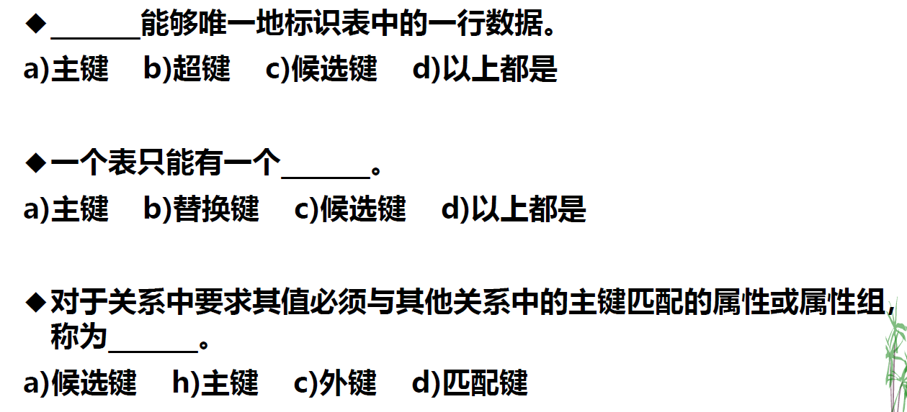

1. d
2. a
3. c
4. d

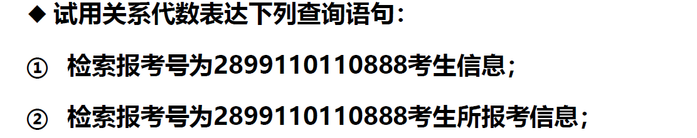

1. $\sigma_{eeid = '2899110110888'}(examinee)$
2. $\sigma_{eeid = '2899110110888'}(eeexam)$

$\Pi_{eid}(\sigma_{eeid = '2899110110888'}(eeexam))$

**检索报考号为2889110110888考生所报考试卷的试卷名**

- 自然连接：$\Pi_{ename}(\sigma_{eeid = '2899110110888'}(eeexam \infty exampaper))$
- 条件连接：$\Pi_{ename}(\sigma_{eeid = '2899110110888'}(eeexam \infty_{eeexam.eid = exampaper.eid} exampaper)$
- 笛卡尔积：$\Pi_{ename}(\sigma_{eeid = '2899110110888'}(\sigma_{eeexam.eid = exampaper.eid}(eeexam \times exampaper))$

$\Pi_{eid}(\sigma_{eeid = '218811011013'}(eeexam)) \cup \Pi_{eid}(\sigma_{eeid = '218811011116'}(eeexam))$

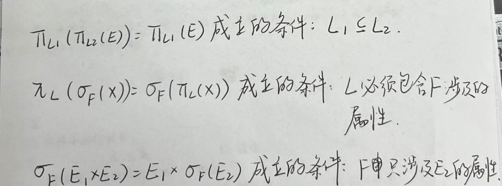

# 第6章 数据库设计：实体-联系方法

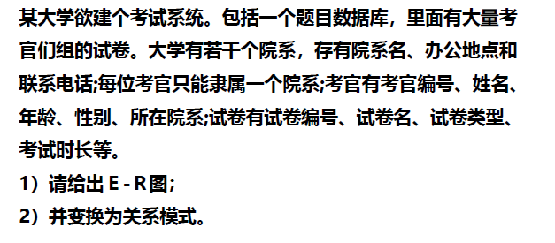

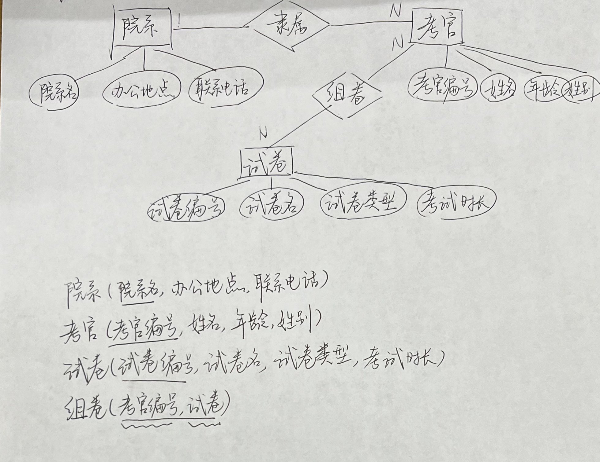

订正一些错误：

- E-R图中没有画出表示主键的下划线
- “考官”关系少写了“所属院系”属性
- “组卷”的第二个属性应该是“试卷编号”

# 第7章 数据库设计：属性-联系方法

## 函数依赖

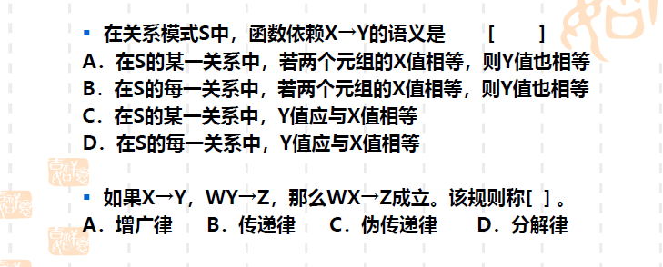

1. B
2. C

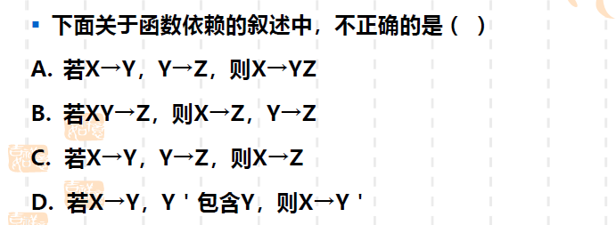

- A. 传递律 + 合并规则
- B. 不对，分解规则是分的右边，左边不能分
- C. 传递律
- D. 不对

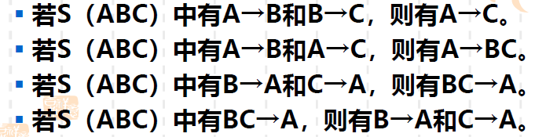

1. √，传递律
2. √，合并规则
3. √，虽然只需要$B\rightarrow A$或$C\rightarrow A$满足一个就行
4. ×，谁教你这么分的？

1. B
2. B

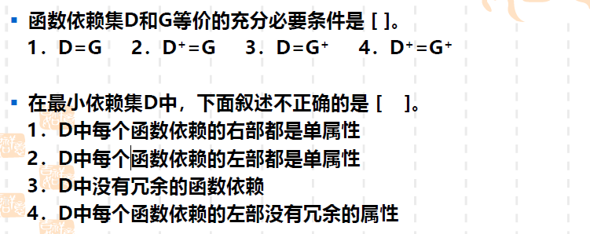

1. 4
2. 2

1. 增广率：$XW \rightarrow YW, YW \rightarrow YZ$
2. 传递律：$XW \rightarrow YZ$

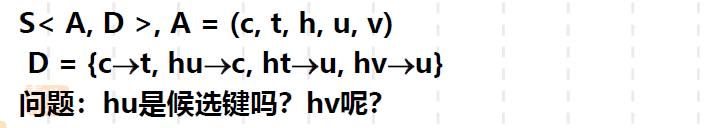

1. hu不是
2. hv是。
   1. hv -> u，增广率 hv -> hu
   2. 传递律 hv -> c, hv -> t，因此hv是超键
   3. h无法决定c, t, u, v，且v无法决定h, c, t, u，因此hv是候选键

## 模式分解

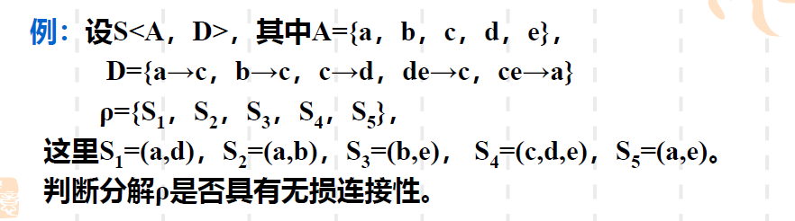

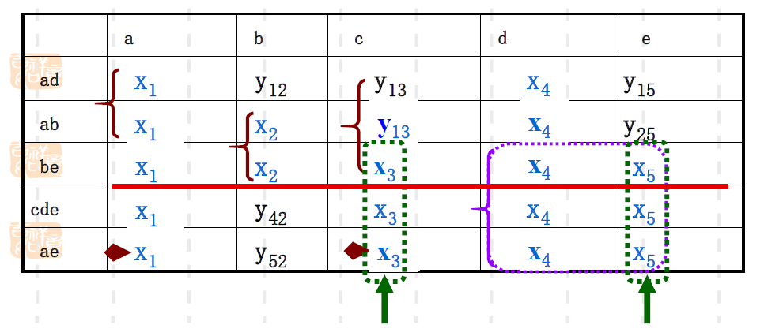

上面这个题说明无损连接性和保持函数依赖性没有必然联系

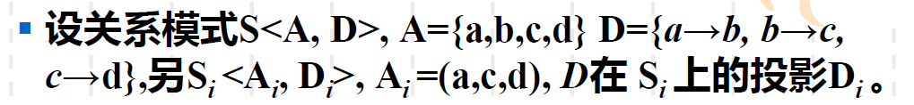

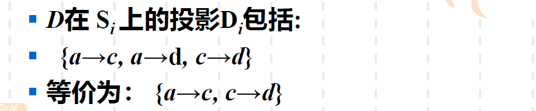

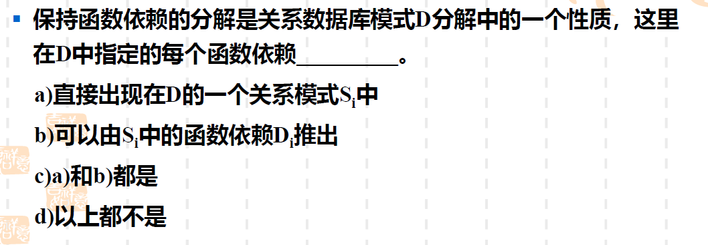

1. a
2. d

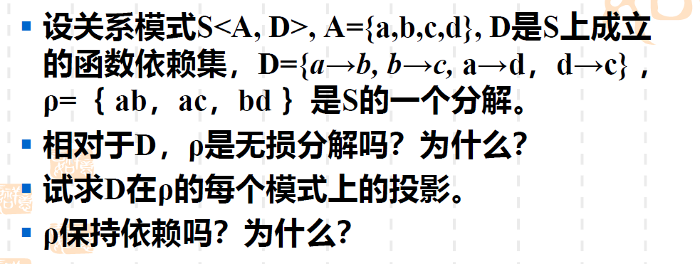

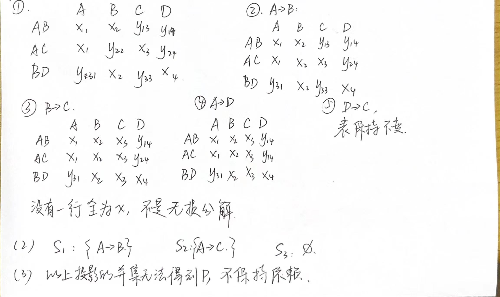

## 范式

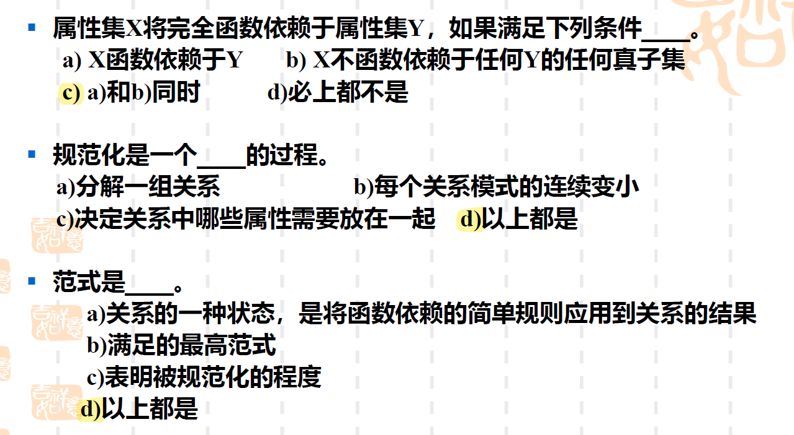

1. 2NF
2. 3NF
3. BCNF

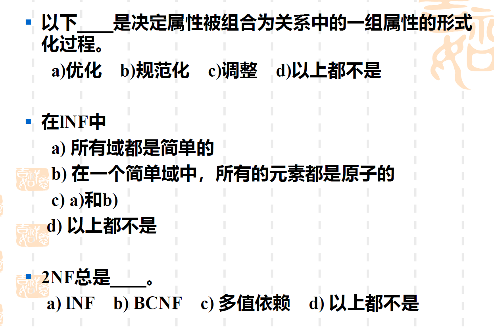

1. b
2. c
3. a

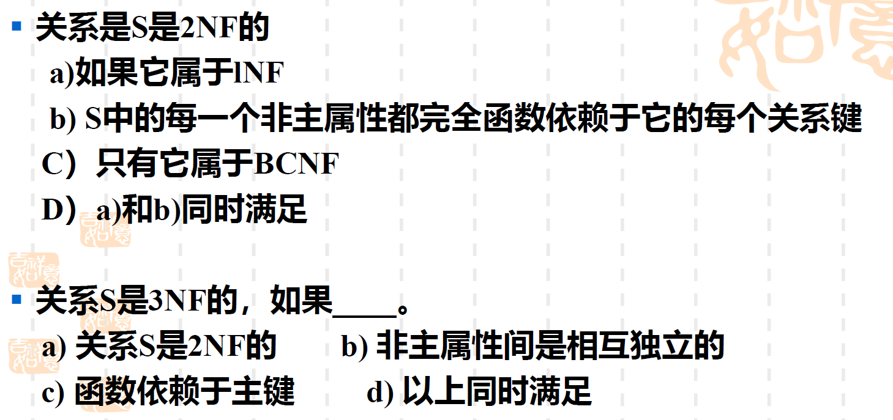

1. d
2. d

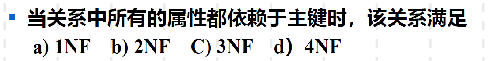

1. a，可能存在属性对主键的部分依赖

1NF。候选键为(a, b)，非主属性d对候选键有部分依赖。

2NF。候选键为C，非主属性a对主属性c有传递依赖。

都是对的。可以分两种情况讨论：

- 候选键只涉及一个属性，那必然不存在属性对主属性的部分和传递依赖
- 候选键由两个属性组成，此时没有非主属性，必定满足3NF；这样的关系模式不存在非平凡的函数依赖（不然一个属性可以决定另一个属性，候选键就不是两个属性并集了），也就不存在主属性对候选键的部分依赖，也就满足BCNF

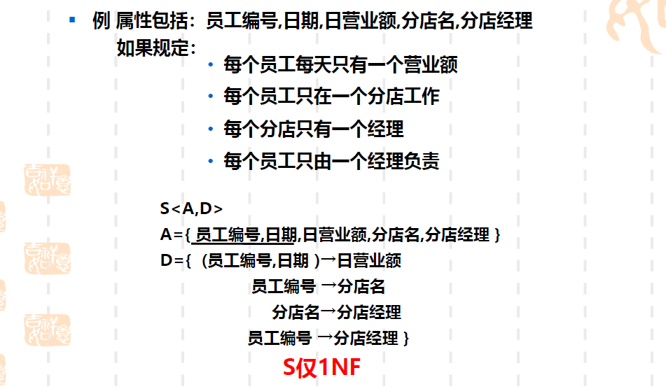

要求分解后满足BCNF：

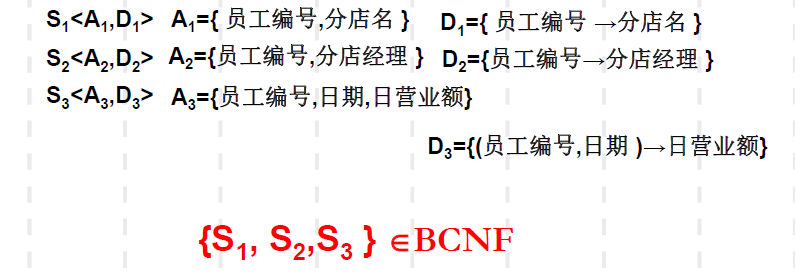

我的理解：首先候选键为A，没有非主属性，肯定满足3NF，接下来要证明不存在主属性对候选键的部分依赖。可以用反证，假设存在主属性对候选键A的部分依赖，也就是 A 的某个子集 X 可以决定其他主属性 Y ：$X \rightarrow Y, X\subsetneqq A$，那么就有$(A - Y) \rightarrow A$（增广律），那A就不是候选键了，矛盾，所以满足BCNF。

# 第9章 查询处理与优化

查询报考'6'号试卷的考生姓名

* 优化前：$Q_1=\pi_{eename}(\sigma_{examinee.eeid=eeexam.eeid \quad AND \quad eid='6'}(examinee \times eeexam))$
* 优化后：$Q_1=\pi_{eename}((\pi_{eeid}(\sigma_{eid='6'}(eeexam)))\infin(\pi_{eeid,eename}(examinee)))$

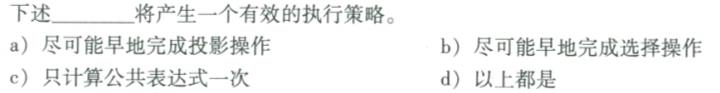

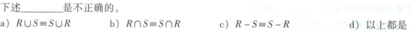

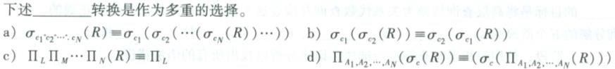

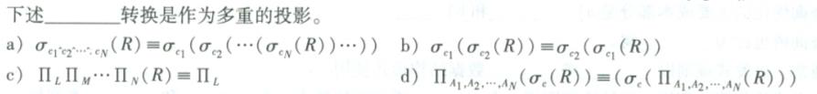

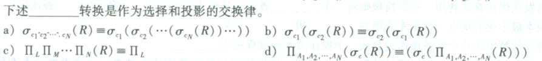

1. d
2. c
3. a
4. c
5. d
6. b

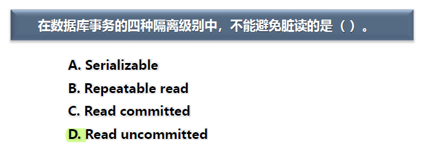

# 第10章 事务

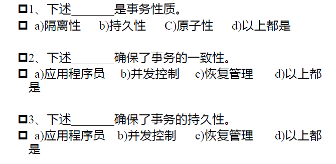

1. d
2. a, 事务的一致性指的是数据库状态和现实世界一致，通过完整性约束和代码正确编写来实现；b和c能确保数据一致性，b确保隔离性，c确保原子性
3. c, 确保事务成功完成后，对数据库所施加的所有更新都是永久的

4. b
5. b（不太确定是不是c）
6. c, 确保事务执行到一半故障的时候，要么全做要么不做

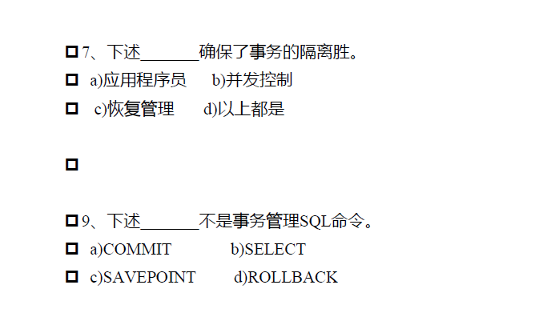

7. b，某个事务可以当做其他事务不存在

9. b，SELECT是查询
